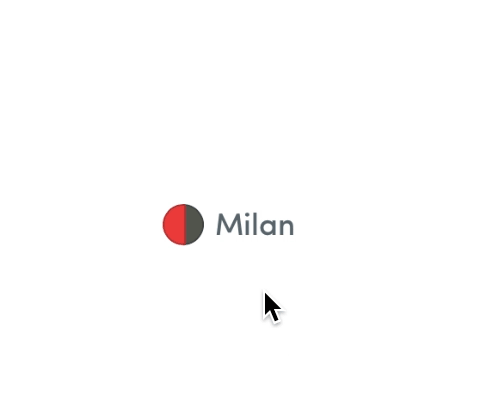

# Tooltip Module for Framer

A simple module for creating a tooltip.

## How To Install
<a href='https://open.framermodules.com/Range Filter'>
    </a>

or

- Copy the ```Tooltip.coffee``` file to your prototype's ```modules``` folder.
- Call ```{tooltip} = require "Tooltip"``` in your Framer prototype.

#### [Try the live demo](https://framer.cloud/PVruS)



## How To Use

#### Initialize default range filter
```coffeescript
# Use tooltip -> ( layerTrigger, layerTooltip, layerTriggerBgColour[optional] )
tooltip.Tooltip(one, tool, "#f8f8f8")
```
